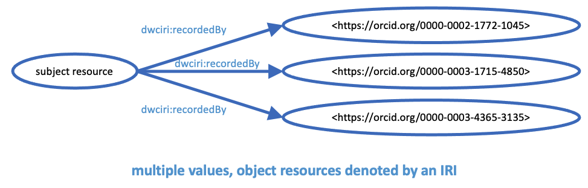
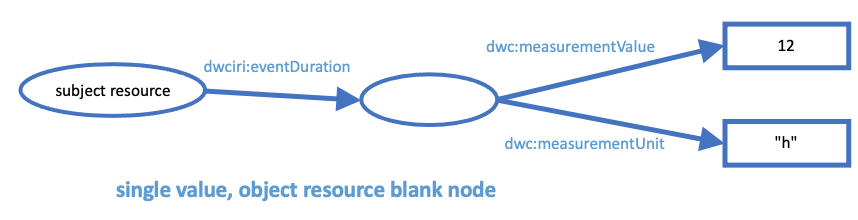
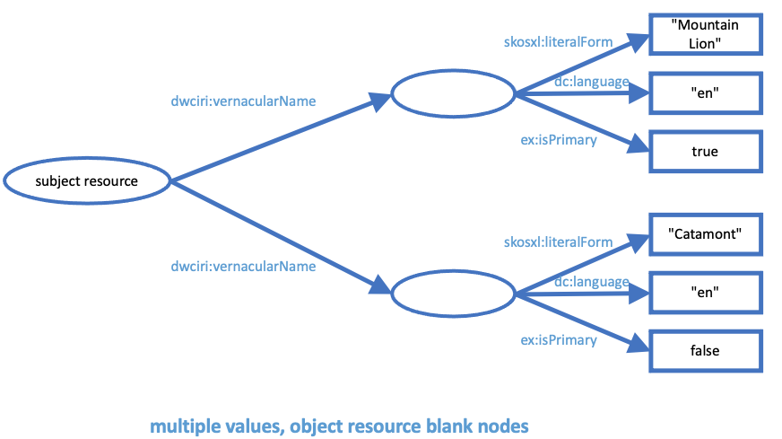

# Complex values categories

Steve Baskauf - 2023-03-30

This document is an attempt to systematically categorize common types of complex values. In each category, a graph diagram shows the general relationships among resources. In the diagrams, ovals represent non-literal resources that are instances of some class, and which could be denoted by IRIs (but in many cases are not; i.e. blank or anonymous nodes). These resources could be further described by making them the subjects of additional triples (i.e. create directed edges from them to other nodes). Rectangles denote literal-valued resources. These resources may represent instances of some class that may be fully described by applying some datatype (e.g. boolean or integer values), or they may simply represent untyped strings whose interpretation is left to the consumer. In either case, they are dead-ends as they cannot serve as the subject of other triples. 

For each category, a simple RDF Turtle serialization is provided to describe the relationships shown in the graph diagram in a machine-readable way. To convert the Turtle into raw triples representing each edge in the diagram, paste the Turtle into an RDF validator/converter, such as [Easy RDF](https://www.easyrdf.org/converter) and select N-Triples as the output format.

Immediately following the Turtle serialization, a JSON-LD serialization is provided ("JSON-LD with CURIES", where [CURIE abbreviates "Compact URIs"](https://www.w3.org/TR/curie/)). There are many forms for JSON-LD and this form was chosen to make the JSON look as similar to the Turtle as possible. To confirm that the graph described by the JSON-LD is identical to that described by the Turtle, paste the JSON-LD into the [JSON-LD Playground](https://json-ld.org/playground/) and select the N-Quads tab for output. Although the arbitrary blank node identifiers used will differ from those generated by Easy RDF, the triples themselves should be identical.

The third example in each category is simple JSON that could be used to express the relationships shown in the diagram. It is similar to what a developer might provide from an API and is in several cases derived from examples provided by Ben Norton. These examples cannot be directly compared with the previous two, since they do not provide the semantic information necessary to map the keys to particular standard vocabulary terms. They also do not distinguish between literal strings and strings that denote IRIs.

The fourth example re-formats the JSON-LD by defining the meaning of each of the keys (i.e. JSON names) in the context node. In the case where values of properties are IRIs, this is declared using `@type` in the context. The result is that the non-context JSON is identical to the simple JSON shown in the third example. In other words, the fourth example shows how precise semantics can be imposed on the simple JSON by providing an appropriate context.

## Category 1: Multiple literal values

This first example is derived from the example for the `dwc:preparations` term in Darwin Core. The standard way for handling multiple values in Darwin Core is to place the multiple values in a single cell of a table and separate them by "space bar space". 

The values, such as "skull" do not have clear semantic meanings. The implication is that this particular specimen has a skull preparation, but there is no expectation that the edge represented shown in the diagram links the subject resource (the specimen) to a particular instance of a skull (i.e. identified by some catalog number or other identifier). An alternate interpretation is that "skull" represents some sort of a controlled value, similar to `cranium` in the Audubon Core subjectPart vocabulary. In that case, the value could instead be replaced by an IRI such as the one for cranium: `http://rs.tdwg.org/acpart/values/p0028`. If that were done, this case would instead fall into Category 2 (below). 

Despite the ambiguity, this type of case is typical for Darwin Core `dwc:` terms that can have multiple values, so showing how it can be represented in JSON provides a useful point of comparison for the more complex examples that follow.


**Current tabular data serialization**

```
"skin | skull | skeleton"
```

**RDF Turtle**

```
@prefix dwc: <http://rs.tdwg.org/dwc/terms/> .
[] dwc:preparations "skin",
                    "skull",
                    "skeleton".
```

**JSON-LD with CURIES**

```
{
  "@context": {
    "dwc": "http://rs.tdwg.org/dwc/terms/"
  },
  "dwc:preparations": [
    "skin",
    "skull",
    "skeleton"
  ]
}
```

**Simplified JSON**

```
{
  "preparations": [
    "skin",
    "skull",
    "skeleton"
  ]
}
```

**JSON-LD without CURIES**

```
{
  "@context": {
    "preparations": "http://rs.tdwg.org/dwc/terms/preparations"
  },
  "preparations": [
    "skin",
    "skull",
    "skeleton"
  ]
}
```

## Category 2: Multiple IRI-denoted values

This category is similar to the first category, but with an important distinction. In this category, the values (i.e. object nodes) are not literal strings, but rather are IRI-valued nodes that represent non-literal values. Because the IRI values denote instances of a class (agents), the IRIs could be used to discover additional information about the agents if there were a source of links from the value nodes to other resources (e.g. data from the ORCID API).

In Darwin Core, properties that have such values are `dwciri:` analogs. The [Darwin Core RDF Guide](https://dwc.tdwg.org/rdf/#25-terms-in-the-dwciri-namespace-normative) prescribes in Section 2.5.1 that "if the dwc: term definition specifies that multiple values should be a concatenated list, the resource described by a dwciri: property SHOULD be the subject of a triple for each value on the list." That is fine when the data are expressed in one of the RDF serializations, but it does not provide any guidance or mechanism for using the `dwciri:` terms in tabular data representations. The "space bar space" convention could be used, but that is not consistent with the spirit of the Darwin Core IRI terms, which were intended to make it possible to provide data that is directly machine interpretable without additional processing. 

In a relational database, a join table could be used to establish the one-to-many relationships between the subject resource (some sort of occurrence) and the object resource (an agent denoted by an ORCID). However, that solution would not be suitable for a single flat table like an Excel spreadsheet. 



**RDF Turtle**

```
@prefix dwciri: <http://rs.tdwg.org/dwc/iri/> .
[] dwciri:recordedBy <https://orcid.org/0000-0002-1772-1045>,
                  <https://orcid.org/0000-0003-1715-4850>,
                  <https://orcid.org/0000-0003-4365-3135>.
```

**JSON-LD with CURIES**

```
{
  "@context": {
    "dwciri": "http://rs.tdwg.org/dwc/iri/"
  },
  "dwcdwciri:recordedBy": [
    {"@id": "https://orcid.org/0000-0002-1772-1045"},
    {"@id": "https://orcid.org/0000-0003-1715-4850"},
    {"@id": "https://orcid.org/0000-0003-4365-3135"}
  ]
}
```

**Simplified JSON**

```
{
  "recordedBy": [
    "https://orcid.org/0000-0002-1772-1045",
    "https://orcid.org/0000-0003-1715-4850",
    "https://orcid.org/0000-0003-4365-3135"
  ]
}
```

**JSON-LD without CURIES**

```
{
  "@context": {
    "recordedBy": {
        "@id": "http://rs.tdwg.org/dwc/iri/recordedBy",
        "@type": "@id"
    }
  },
  "recordedBy": [
    "https://orcid.org/0000-0002-1772-1045",
    "https://orcid.org/0000-0003-1715-4850",
    "https://orcid.org/0000-0003-4365-3135"
  ]
}
```

## Category 3: Single blank node value

This category represents the simplest case where a property has a value that is an instance of a class, but where that instance is not identified by an IRI. In RDF, this situation is called a "blank" or "anonymous" node. The property shown in this example is not a real Darwin Core property (at least not as of 2023-03-30). It is a fanciful `dwciri:` analog of `dwc:eventDuration`. 

In this case, the value of the `dwciri:eventDuration` property could be considered an instance of the `dwc:MeasurementOrFact` class. One could assign an identifier to this particular measurement, but in many cases the data provider would be unlikely to want to maintain that identifier. There would also be little use in using such an identifier as a mechanism for discovering additional information about the measurement (as in the case of Category 2) if only the value and unit are provided (although other information such as provenance could be very valuable if it were available).  So this is a situation where leaving the measurement instance as anonymous node could make a lot of sense.

Linking the measurement node to its value and unit requires two additional properties to make the link. I chose to used two existing terms grouped within the MeasurementOrFact class of Darwin Core. This does not follow the original design pattern for the MeasurementOrFact class, but it is not proscribed either. 

The simplest way to represent this relationship in JSON is to use a JSON object as the value. That works well in this case, where it is unlikely that there would ever be multiple values for the `dwciri:eventDuration` property. However, in cases where multiple values are possible or likely, adopting this structure for single values requires a separate processing regime for cases where there are multiple values. So in any case where multiple values are possible (Category 4 below), always making the object be part of a JSON array is a better design pattern (see for example [Section] 3.4.1 of the IIIF Design Principles](https://iiif.io/api/annex/notes/design_principles/#use-consistent-structural-conventions)).



**RDF Turtle**

```
@prefix dwciri: <http://rs.tdwg.org/dwc/iri/> .
@prefix dwc: <http://rs.tdwg.org/dwc/terms/> .
[] dwciri:eventDuration [
    dwc:measurementValue 12;
    dwc:measurementUnit "h"
    ].
```

**JSON-LD with CURIES**

```
{
  "@context": {
    "dwciri": "http://rs.tdwg.org/dwc/iri/",
    "dwc": "http://rs.tdwg.org/dwc/terms/"
  },
  "dwciri:eventDuration": {
    "dwc:measurementValue": 12,
    "dwc:measurementUnit": "h"
  }
}
```

**Simplified JSON**

```
{
  "eventDuration": {
    "measurementValue": 12,
    "measurementUnit": "h"
  }
}
```

**JSON-LD without CURIES**

```
{
  "@context": {
    "eventDuration": {
        "@id": "http://rs.tdwg.org/dwc/iri/eventDuration"
    },
    "measurementValue": {
        "@id": "http://rs.tdwg.org/dwc/terms/measurementValue"
    },
    "measurementUnit": {
        "@id": "http://rs.tdwg.org/dwc/terms/measurementUnit"
    }
  },
  "eventDuration": {
    "measurementValue": 12,
    "measurementUnit": "h"
  }
}
```

## Category 4: Multiple blank node values

The final example extends Category 3 to situations where a property can have multiple values that are unidentified instances of a class (i.e. non-literal resources that are blank nodes). Again it uses a fanciful Darwin Core term that currently does not exist (`dwciri:vernacularName`). It also uses (abuses?) a term from the SKOS-XL vocabulary to denote the string representation of the vernacular name instance. (Other options, such as `rdf:value` are possible.) For convenience, in this example the language of the string value is expressed directly through the property `dc:language` rather than using a language-tagged literal for `skosxl:literalForm`. The third property used to describe the vernacular name, `ex:isPrimary` is a property made-up for this example.

As noted in Category 3, since multiple values are possible for `dwciri: vernacularName`, the objects describing each name instance are included within an array. To enable consistent processing of the JSON, this array should be present even in cases where there are one or zero vernacular names.



**RDF Turtle**

```
@prefix dwciri: <http://rs.tdwg.org/dwc/iri/> .
@prefix dc: <http://purl.org/dc/elements/1.1/> .
@prefix skosxl: <http://www.w3.org/2008/05/skos-xl#> .
@prefix ex: <http://example.org/> .
[] dwciri:vernacularName [
    skosxl:literalForm "Mountain Lion";
    dc:language "en";
    ex:isPrimary true
    ],
    [
    skosxl:literalForm "Cougar";
    dc:language "en";
    ex:isPrimary false
    ].
```

**JSON-LD with CURIES**

```
{
  "@context": {
    "dwciri": "http://rs.tdwg.org/dwc/iri/",
    "dc": "http://purl.org/dc/elements/1.1/",
    "skosxl": "http://www.w3.org/2008/05/skos-xl#",
    "ex": "http://example.org/"
  },
  "dwciri:vernacularName": [
    {
    "skosxl:literalForm": "Mountain Lion",
    "dc:language": "en",
    "ex:isPrimary": true
    },
    {
    "skosxl:literalForm": "Cougar",
    "dc:language": "en",
    "ex:isPrimary": false
    }
  ]
}
```

**Simplified JSON**

```
{
  "vernacularName": [
    {
    "literalForm": "Mountain Lion",
    "language": "en",
    "isPrimary": true
    },
    {
    "literalForm": "Cougar",
    "language": "en",
    "isPrimary": false
    }
  ]
}
```

**JSON-LD without CURIES**

```
{
  "@context": {
    "vernacularName": {
        "@id": "http://rs.tdwg.org/dwc/iri/vernacularName"
    },
    "literalForm": {
        "@id": "http://www.w3.org/2008/05/skos-xl#literalForm"
    },
    "language": {
        "@id": "http://purl.org/dc/elements/1.1/language"
    },
    "isPrimary": {
        "@id": "http://example.org/isPrimary"
    }
  },
  "vernacularName": [
    {
    "literalForm": "Mountain Lion",
    "language": "en",
    "isPrimary": true
    },
    {
    "literalForm": "Cougar",
    "language": "en",
    "isPrimary": false
    }
  ]
}
```
