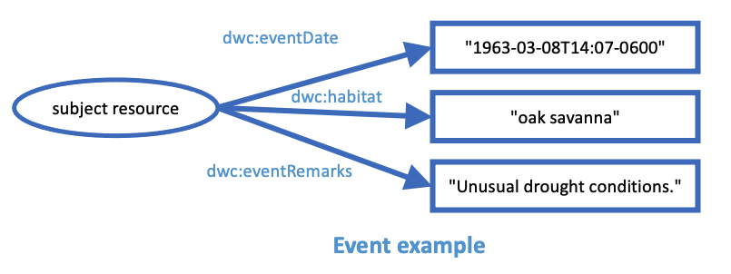

# Complex values serialization strategies

Steve Baskauf - 2023-05-02

# Background

The primary use of TDWG vocabularies is to facilitate data sharing. At the "bag of terms" level, TDWG vocabularies provide property and controlled value terms that ensure a common understanding of the meaning of the atomic data being shared. Individuals or organizations may use TDWG vocabulary terms to organize their internal databases in any way that they see fit. However, in order to facilitate interoperability, it is critical that during data sharing both the sender and receiver have a mutual understanding of how the data will be structured so that it is clear to which entities the properties and their values apply. 

In current (2023) practice, there are four main forms of serialization that are commonly used to transmit data. The two most common are probably **tabular data** in the form of delineated text (e.g. Simple Darwin Core and Darwin Core Archives) and **JSON** as delivered via APIs. Another significant form of serialization is **XML** (e.g. ABCD, Plinian Core, and others). Less common but important in Linked Data efforts is **RDF** in its various serializations (e.g. Turtle and JSON-LD). 

## Interpretation of semantics and the structure of data in common serializations

Of these four serialization types, RDF is probably the most self-descriptive, since by design it provides both structure and context to the data. XML can also be designed to be self-descriptive since it is designed to encode structure and schemas can be used to provide context. Generic JSON served via APIs may be structured in complex ways, but it is not self-descriptive and requires a human-readable API guide in order to enable developers of consuming applications to be clear about how to interpret the names (keys) and structure of the provided data. 

Unfortunately, the most commonly used serialization (tabular data) is potentially the least clear about interpretation of its column headers as well as the intended relationship structure when data describing several entities are flattened into a single table. There are various attempts to clarify the semantics encoded by tabular data, including the meta.xml file of Darwin Core Archives, the JSON schema file of Frictionless Data Packages, and components of the W3C Tabular Data on the Web specifications. 

Ideally, data could be translated between any of these serializations without loss of semantics or structure. In other words, data provided in any of these serialization types should result in the same abstract graph of property relationships among entities. 

## Purpose of this document

The purpose of this document is to describe the issues related to serializing complex values of TDWG properties for the two least self-descriptive serialization types: tabular data and JSON served by APIs. 

## Abstract example

The following graph illustrates the abstract relationships between a subject instance of the Event class and the values of its properties:



# Tabular Data

The simplest interpretation of tabular data is that a table represents a class, rows represent instances (or individuals) of that class, and that columns represent properties appropriate for instances of the class. The contents of table cells represent the values of the column property for the row individual (the subject resource).

| eventDate | habitat | eventRemarks |
| ------------- | ----------- | ---------------- |
| 1963-03-08T14:07-0600 | oak savanna | Unusual drought conditions. |
...

## Issues

1\. In the example above, each property has only a single value. However, in many cases multiple values are appropriate for a property. The current convention in TDWG is to use "space pipe space" (` | `) to separate the values within a cell. Here's an example:

| recordedBy | preparations | disposition |
| ------------- | ----------- | ---------------- |
| Achmed Khan | skull \| skin | in collection |

Is it appropriate to use the "space pipe space" convention for multiple IRI values for `dwciri:` terms. Here is an example:

| dwciri:recordedBy | preparations | disposition |
| ------------- | ----------- | ---------------- |
| https://orcid.org/0000-0003-1715-4850 \| https://orcid.org/0000-0003-4365-3135 | herbarium sheet | in collection |

Problems:
- How do we differentiate between `dwc:recordedBy` and `dwciri:recordedBy`? Require namespace abbreviations for column headers in all cases? ... only in some cases (e.g. when using `dwciri:`)?
- A major point of the `dwciri:` terms is to provide data that can be consumed by a machine without additional processing. The "space pipe space" approach implies parsing and string processing. Would it be better to use a JSON array as the value so that the multiple values could be directly consumed and converted to a data structure (e.g. into a Python list using `json.loads`)? That would look like this:

| dwciri:recordedBy | preparations | disposition |
| ------------- | ----------- | ---------------- |
| `["https://orcid.org/0000-0003-1715-4850", "https://orcid.org/0000-0003-4365-3135"]` | herbarium sheet | in collection |

2\. In some cases, the value of a property requires two components to fully describe it. A common example is values with units. We see a variety of approaches to this issue:
- define a single term so that it may only use a particular unit. Example: `dwc:coordinateUncertaintyInMeters`.
- define a single term whose string value includes the unit. Example: `dwc:verbatimDepth`.
- define two terms: one for the term and one for the unit. An example is `dwc:sampleSizeValue` and `dwc:sampleSizeUnit`.
- define a single term whose value contains structured data. `dwc:dynamicProperties` is an example that suggests JSON as the mechanism for structuring, although the existing examples don't show it being used with values and units.

Here is a fanciful example illustrating all of these approaches:

| coordinateUncertaintyInMeters | verbatimDepth | sampleSizeValue | sampleSizeUnit | dynamicProperties |
| ------------- | ----------- | ---------------- | ----------- | ---------------- |
| 1000 | 15 m | 5 | metre | {"bodyLengthValue":26, "bodyLengthUnit":"cm"} |

Problems:
- How do we handle cases where the best practice is to use a controlled value for one of the components, such as units? It would be best to use an IRI to a standard term, which brings up the same IRI usues as in the previous example.
- What happens when there are multiple values for a property that requires two components to describe it? The Humboldt Extension has such a case: `eco:samplingEffortValue` and `eco:samplingEffortUnit`. In most installations, there would only be a single value for sampling effort. But in the case of eBird, multiple measures of sampling effort are recorded. Using the "space pipe space" approach is problematic since it is unclear which of the multiple values for one property are associated with which of the multiple values for another. Example:

| protocolNames | samplingEffortValue | samplingEffortUnit |
| ---- | ------------- | ----------- |
| eBird complete checklist | 2568 \| 3.6 | meters \| hours |

One possible solution would be to use structured data (a JSON array containing a JSON object for each value) for a single property:

| protocolNames | samplingEffort |
| ---- | ------------- |
| eBird complete checklist | `[{"value":2568,"unit":"meters"},{"value":3.6,"unit":"hours"}]` |

This approach would provide the necessary structure to remove the ambiguity, but would be difficult to implement by a human typing into a spreadsheet.

## Vanilla JSON

The simplest interpretation of JSON is that JSON objects represent instances (or individuals) of a class, that the names (i.e. keys) represent properties appropriate for instances of that class, and the values in the name:value pairs represent values of the name property for the individual represented by the object (the subject resource). To represent many instances, multiple JSON objects are placed within an array.

```
[
  {
  "eventDate": "1963-03-08T14:07-0600",
  "habitat": "oak savanna",
  "eventRemarks": "Unusual drought conditions."
  },
...
]
```

## Issues

1\. When multiple values are present in JSON, they can be represented by an array. Here's an example:

```
  {
  "recordedBy": "Achmed Khan",
  "preparations": [
    "skull",
    "skin"
    ],
  "disposition": "in collection"
  }
```

How do we handle IRI values of `dwciri:` terms? Here is an example:

```
  {
  "dwciri:recordedBy": [
    "https://orcid.org/0000-0003-1715-4850",
    "https://orcid.org/0000-0003-4365-3135"
    ],
  "preparations": "herbarium sheet",
  "disposition": "in collection"
  }
```

Problems:
- How do we differentiate between `dwc:recordedBy` and `dwciri:recordedBy`? Require namespace abbreviations for all names (keys)? Require them only for some (e.g. for `dwciri:` but not `dwc:`)?
- How do we know that the values are IRIs and not untyped strings?

2\. 


----------

eBird has multiple values for
eco:samplingEffortValue and eco:samplingEffortUnit

targetTaxonomicScope etc.