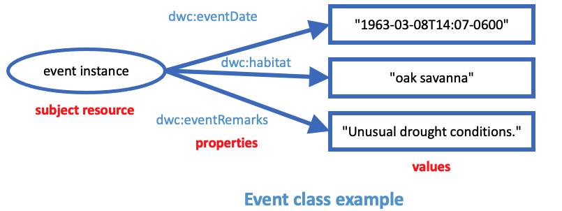

# Complex values serialization strategies

Steve Baskauf - 2023-05-02

# Rationale

The primary use of TDWG vocabularies is to facilitate data sharing. At the "bag of terms" level, TDWG vocabularies provide property and controlled value terms that ensure a common understanding of the meaning of the atomic data being shared. Individuals or organizations may use TDWG vocabulary terms to organize their internal databases in any way that they see fit. However, in order to facilitate interoperability, it is critical that during data sharing both the sender and receiver have a mutual understanding of how the data will be structured so that it is clear to which entities the properties and their values apply. 

In current (2023) practice, there are four main forms of serialization that are commonly used to transmit data. The two most common are probably tabular data in the form of delineated text (e.g. Simple Darwin Core and Darwin Core Archives) and JSON as delivered via APIs. Another significant form of serialization is XML (e.g. ABCD, Plinian Core, and others). Less common but important in Linked Data efforts is RDF in its various serializations (e.g. Turtle and JSON-LD). 

Of these four serialization types, RDF is probably the most self-descriptive, since by design it provides both structure and context to the data. XML can also be designed to be self-descriptive since it is designed to encode structure and schemas can be used to provide context. Generic JSON served via APIs may be structured in complex ways, but it is not self-descriptive and requires a human-readable API guide in order to enable developers of consuming applications to be clear about how to interpret the names (keys) and structure of the provided data. 

Unfortunately, the most commonly used serialization (tabular data) is potentially the least clear about interpretation of its column headers as well as the intended relationship structure when data describing several entities are flattened into a single table. There are various attempts to clarify the semantics encoded by tabular data, including the meta.xml file of Darwin Core Archives, the JSON schema file of Frictionless Data Packages, and components of the W3C Tabular Data on the Web specifications. 

Ideally, data could be translated between any of these serializations without loss of semantics or structure. In other words, data provided in any of these serialization types should result in the same abstract graph of property relationships among entities. 

The purpose of this document is to describe the issues related to serializing complex values of TDWG properties for the two least self-descriptive serialization types: tabular data and JSON served by APIs. 

## Abstract example

The following graph illustrates the abstract relationships between a subject instance of the Event class and the values of its properties:



# Tabular Data

The simplest interpretation of tabular data is that a table represents a class, rows represent instances (or individuals) of that class, and that columns represent properties appropriate for instances of the class. The values in table cells represent the values of the column property for the row individual (the subject resource).

| eventDate | habitat | eventRemarks |
| ------------- | ----------- | ---------------- |
| 1963-03-08T14:07-0600 | oak savanna | Unusual drought conditions. |
...

## Issues

x

## Vanilla JSON

The simplest interpretation of JSON is that JSON objects represent instances (or individuals) of a class, that the names (i.e. keys) represent properties appropriate for instances of that class, and the values in the name:value pairs represent values of the name property for the individual represented by the object (the subject resource). To represent many instances, multiple JSON objects are placed within an array.

```
[
  {
  "eventDate": "1963-03-08T14:07-0600",
  "habitat": "oak savanna",
  "eventRemarks": "Unusual drought conditions."
  },
...
]
```

## Issues

x
