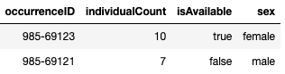

# Best practices for serializing booleans

**Title:** Best practices for serializing booleans

**Date modified:** 2023-01-08

**Part of TDWG Standard:** Not part of any standard

**Abstract:** This document describes how the boolean concepts defined in the TDWG Boolean Controlled Vocabulary should be serialized in various data transfer formats.  

**Contributors:** Steve Baskauf

**Creator:** TDWG Technical Architecture Group (TAG)

**Bibliographic citation:** Technical Architecture Group. 2023. Best practices for serializing booleans. Biodiversity Information Standards (TDWG). https://tdwg.github.io/tag/guides/boolean/

## 1 Introduction

Value terms in TDWG controlled vocabularies are typically modeled as SKOS Concepts. As such, they can be considered abstract concepts that are independent of any particular serialization. 

The metadata of a TDWG controlled value term provides two standard ways to denote that concept: a term IRI, which serves as a globally unique identifier and a controlled value string, which indicates how the concept should be designated in text-based systems such as CSV files or database tables. 

This document describes how the concepts of the [TDWG Boolean Controlled Vocabulary](https://tdwg.github.io/tag/boolean/) can be represented in various serializations.  

### 1.1 RFC 2119 key words
The key words "MUST", "MUST NOT", "REQUIRED", "SHALL", "SHALL NOT", "SHOULD", "SHOULD NOT", "RECOMMENDED", "MAY", and "OPTIONAL" in this document are to be interpreted as described in [RFC 2119](https://tools.ietf.org/html/rfc2119).

## 2 Delineated tabular data

In delineated tabular data files (e.g. CSV and TSV), the controlled value strings from the TDWG Boolean Controlled Vocabulary MUST be used. Labels in non-English languages MUST NOT be used as values in tabular data files, although they may be presented to users in pick lists or other tools that will generate the correct controlled value strings for tabular output. 

### 2.1 Table schemas

When a Table Schema is provided to describe the contents of the table, the type of the column SHOULD be described as boolean using the mechanism appropriate for the framework. For [Frictionless Data](https://frictionlessdata.io/), use `boolean` as the string indicator of the type property [[1]](#1) [[2]](#2). When using the [Model for Tabular Data and Metadata on the Web](http://www.w3.org/TR/tabular-data-model/), the specified datatype MUST be `xs:boolean` [[3]](#3). The cell values MUST be the controlled value strings. They MUST NOT be the alternate values allowed by the specification [[4]](#4).

## 3 JSON

Boolean values in JSON are expressed as the controlled value strings without quotation marks. Example:

`true`

### 3.1 API responses

When values from the controlled vocabulary for booleans are served via an API response, they MUST be serialized as JSON booleans and not as controlled value strings, even if source tabular data represents them as strings. 

*Correct:*

```
{
    "isAvailable": true
}
```

*Incorrect:*

```
{
    "isAvailable": "true"
}
```

## 4 XML

Boolean values in XML are expressed as the controlled value strings without quotation marks and are datatyped using XML Schema. Example:

`<isAvailable rdf:datatype="http://www.w3.org/2001/XMLSchema#boolean">true</isAvailable>`

## 5 RDF serializations

In RDF, booleans are represented as literals having the XML datatype `xs:boolean` (`http://www.w3.org/2001/XMLSchema#boolean`). The literal values are the same as the controlled value strings defined in the TDWG vocabulary. 

Therefore, to transform a controlled vocabulary concept to RDF, designate the controlled value string as a literal using the mechanism appropriate for the RDF serialiation and datatype it as `xsd:boolean`. Examples:

N-Triples: `"true"^^<http://www.w3.org/2001/XMLSchema#boolean>`

Turtle (where `xs:` is defined conventianally in the namespace declarations): `"true"^^xs:boolean`

XML (as described in Section 3 above, but where `ns:prop` is the predicate) `<ns:prop rdf:datatype="http://www.w3.org/2001/XMLSchema#boolean">true</ns:prop>`

### 5.1 JSON-LD

Since JSON-LD is valid JSON in addition to a possible RDF serialization, booleans are serialized in the same way as in JSON: using the controlled value strings without quotation marks. Example:

`true`

### 5.2 Turtle (Terse RDF Triple Language)

Boolean values can be expressed as datatyped strings as shown in section 2, but Turtle also allows the syntactic sugar of providing the controlled value strings without quotation marks. Example:

`true`

## 6 Databases

Boolean values are represented in a variety of ways in common database systems. For a summary, see Table 1A. in the Appendix of the *Boolean Values Best Practices Reference* document [[5]](#5). When the database system provides native support for a boolean data type, values MAY be typed in accordingly. However, if data are exported as delineated text tables, the values MUST be transformed to conform to the requirements given in Section 2 above. If the boolean data are exported as JSON or XML (e.g. via an API) they must conform to the datatyped serializations of Sections 3 and 4 respectively.

## 7 Programming languages

The mechanisms for typing booleans varies among programming languages and is summarized in Table 2A. in the Appendix of the *Boolean Values Best Practices Reference* document [[5]](#5). From the perspective of interoperability, what happens within processing code is a black box that is not the concern of producers of data ingested by the code and consumers of data produced by the code as long as the input and output conforms to the serialization guidelines in Sections 2 through 5. However, programmers need to ensure that the datatyping requirements of those sections are preserved when data are read from or written to files.

In the following Python example, data are input and written as JSON.

```
import json
with open('input_file.json', 'rt', encoding='utf-8') as file_object:
    file_text = file_object.read()
python_data_structure = json.loads(file_text)

# Processing code here. Values that were booleans in the JSON are boolean Python objects.

output_text = json.dumps(modified_python_data_structure, indent=2)
with open('output_file.json', 'wt', encoding='utf-8') as file_object:
    file_object.write(output_text)
```
Because the `json.loads()` and `json.dumps()` functions preserve the datatyping, values that were datatyped as boolean in the input JSON will remain datatyped as boolean in the output JSON.

Now consider the following Python example that uses these data for input:




```
import pandas as pd
import json

string_data = pd.read_csv('input_file.csv', dtype = str)

# Processing code here. Controlled value strings for booleans are input as strings.

output_dict = dict(string_data.iloc[0]) # Convert the first row to a dictionary.
output_text = json.dumps(output_dict, indent=2)
with open('output_file.json', 'wt', encoding='utf-8') as file_object:
    file_object.write(output_text)
```

In this case, all values are read from the input CSV as strings. So when the output JSON is generated, the boolean values will be treated as strings. So the (incorrect) output JSON will be:

```
{
  "occurrenceID": "985-69123",
  "individualCount": "10",
  "isAvailable": "true",
  "sex": "female"
}
```

which expresses the boolean as the string `"true"` rather than as a boolean `true` value.

The point is that care must be taken to ensure that any necessary boolean datatyping is applied to the data upon output to comply with the requirements of Sections 2 though 5.

# 8 References

<a id="1"></a>[1] Frictionless Standards Table Schema, Types and Formats https://specs.frictionlessdata.io/table-schema/#types-and-formats

<a id="2"></a>[2] JSON Schema: type https://datatracker.ietf.org/doc/html/draft-zyp-json-schema-03#section-5.1

<a id="3"></a>[3] Model for Tabular Data and Metadata on the Web, Datatypes https://www.w3.org/TR/2015/REC-tabular-data-model-20151217/#datatypes

<a id="4"></a>[4] Model for Tabular Data and Metadata on the Web, https://www.w3.org/TR/2015/REC-tabular-data-model-20151217/#formats-for-booleans

<a id="5"></a>[5] Technical Architecture Group (TAG). 2023. Boolean Values Best Practices Reference. Biodiversity Information Standards (TDWG). URL here