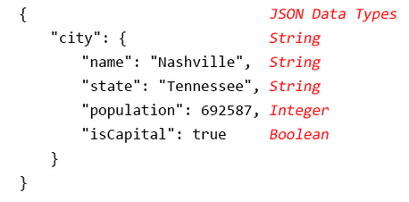

# Boolean Values Best Practices Reference

**Title:** Boolean Values Best Practices Reference

**Date Modified:** 2023-03-06

**Version**: 20230306.1

**Part of TDWG Standard:** Not part of any standard

**Abstract:** The following is a summary of best practices for the use
of boolean values.

-   Use an enumerated domain containing two and only two values, `true` and `false`.

-   Domain values should be lowercase, non-localized, and not abbreviated

**Contributors:** Ben Norton (author, Head of Technology and Collections Data Curator, NCMNS, Contact: [ben.norton@naturalsciences.org](mailto:ben.norton@naturalsciences.org), Steve Baskauf (reviewer), Tim
Robertson (reviewer), John Wieczorek (reviewer)

**Creator:** TDWG Technical Architecture Group (TAG)

**Bibliographic citation:** Technical Architecture Group. 2023. Boolean Values Best Practices Reference. Biodiversity Information Standards
(TDWG).

## 1 Best Practices Recommendation

The recommendation of the TDWG Technical Architecture Group for
providing boolean values is to use a value domain composed of the two
lowercase and non-localized character strings, `true` and `false`.
Alternate true and false versions such as the abbreviations `T` and
`F`, uppercase strings `TRUE` and `FALSE`, or localized versions
such as `vrai` and `faux` are not permitted. The \[`true`,
`false`\] value domain is highly interoperable as the most widely used
representation of boolean values. In addition, most major programming
languages provide native support for the boolean data type with methods
to cast values to the boolean data type readily. In contrast, support by
major database vendors varies. However, those vendors without native
support provide an alternate mechanism for handling the boolean data
type.

### 1.1 Usage in Computing

In modern computing, the boolean data type is a primitive type (a type
not derived from another) that represents the truth of an expression
using two numerical values, 0 or 1. Handling boolean values, including
the enumerated domain values and syntax, varies between programming
languages and database technologies. [Tables 1-3 in Appendix 1](#appendix-1-boolean-support-and-compatibility) summarize
support for the boolean data type for many popular programming languages
and database vendors. In contrast to programming languages, all database
technologies do not provide native support for the boolean data type
(e.g., MySQL, MSSQL, SQLite). In these cases, they offer an alternative
mechanism or best practice, which is denoted accordingly in the tables.

To understand how boolean values are used in computing, we first must
distinguish between the boolean data type and boolean expressions
(operations and comparisons to evaluate truth). The latter uses a set of
logical operators in a control structure (e.g., if/else, while loop,
case, switch) to evaluate whether or not something is true. The value
returned from a boolean expression is always a boolean value. The
boolean data type refers to a primitive data type with values limited to
a pair of valid values or enumerated domain (true,false, 0,1). Boolean
data type variables represent whether or not something is true or false.
The boolean data type is representative, whereas the boolean expression
is evaluative. Support for booleans by the popular programming language
Python provides a good example of this conceptual distinction. In
Python, depending on purpose/context, boolean expressions utilize either
the boolean operators *and, or, not* or comparison operators *\<, \<=,
\>, \>=, ==, !=, is, is not*. Boolean values in Python are limited to a
single enumerated domain that contains True and False.

### 1.2 Enumerated Domains

Throughout this document, pairs of valid values for the boolean data
type are referred to as boolean enumerated domains. In statistics,
informatics, and data science, enumerated domains are value domains
comprised of a list of permissible values. For most technologies, values
that belong to the boolean data type are restricted to the boolean
enumerated domain. Values in boolean enumerated domains are not limited
to specific character strings. Rather, they are restricted to one or
more two-state values. Numeric boolean enumerated domains (or numeric
boolean domains) are a special type that only contains the numbers 0 and 1. In Tables 1-3, boolean enumerated domains are denoted with square
brackets.

### 1.3 Numerical Misinterpretation

When the boolean data type exists, 0 and 1 do not behave like
traditional integers (where 1 + 1 = 2 ). Rather they are binary
representations of a true/false concept. It is important to make clear
the distinction so that columns with boolean data values are not
misinterpreted as numerical integers with mathematical implications.

## 2 Recommendations

1.  When the boolean data type exists, 0 and 1 do not behave like traditional integers (where 1 + 1 = 2 ). Rather they are binary representations of a true/false concept. A clear distinction is crucial to mitigate the risk of misinterpreting boolean data values as integers with mathematical implications. Camel-cased terms expecting boolean values should be prefaced with *is* (e.g., isExtinct, isTypeSpecimen). Snake-cased terms should be appended with *\_yn* (e.g., extinct_yn, type_specimen_yn).

2.  The boolean enumerated domain \[true, false\] is the most interoperable domain with the widest support by major programming languages and database technologies.

3.  The numeric boolean enumerated domain \[0, 1\] should be used for ETL (Extract, Transform, Load) processes with database technologies that lack native boolean support. Otherwise, the numeric domain should be avoided to mitigate risks associated with numerical misinterpretation.

4.  The values `true` and `false` should always be lowercase to minimize the interoperability issues with case-sensitive systems. The casing changes should be strictly need based in cases where capitalization is necessary for compatibility. For example, Python boolean values are proper-cased (True, False). Usage of the proper-cased versions of true and false should be strictly limited to the Python application codebase where it is needed for compatibility.

5.  Do not use abbreviations for boolean values (e.g., `T`, `F`, `t`). Abbreviations can be easily misinterpreted and are weak concept representations.

6.  Null is not a boolean value and therefore does not belong in a column with a boolean data type. A default value should be assigned to boolean data types to avoid null values entirely. If a *null* value is needed to express a property accurately, then the table and column decisions should be re-evaluated.

7.  Character string values that belong to a boolean enumerated domain should not be localized. For example, the French translations of `true` and `false`, `vrai` and `faux`, are not valid boolean enumerated domain values.

8.  To accommodate the *not null* restriction, columns defined using the boolean data type in database schemas should always include a default boolean enumerated domain value.

## Appendix 1. Boolean Support and Compatibility
---------------------------------------------

### Table 1A. Databases

| Database | Domains | Data Type | Remarks |
| -------- | ------- | --------- | ------- |
| MySQL    |    \[1,0\]                |               TINYINT(1)  | MySQL does not provide native support for the boolean data type. Instead, boolean values as commonly stored as 0 or 1 in the single byte data type, TINYINT(1) |
| PostgreSQL  | \[on,off\], \[true/false\], \[1,0\] |  BOOL     |    In PostgreSQL, the boolean enumerated domain consists of 3 pairs of two-state values (six values in total). Boolean values must be consistent. Mixing values from two or more pairs within a single column is not allowed. |
| MSSQL    |    \[1,0\]          |                     BIT     |     MSSQL does not provide native support for the boolean data type. The common practice is to store boolean values in a BIT data type column as 0 or 1. |
| MS Access  |  \[Yes,No\]               |             Yes/No  |     MS Access does not directly support boolean data types. Instead, MS Access provides a Yes/No data type that may be formatted in three ways for front-end presentation (Yes/No, True/False, On/Off). In Access, Yes/No data type is equivalent to the SQL Data Type BIT with one minor adjustment. In Access, Yes (true) is stored as -1, and No (false) is stored as 0. If no value is provided, the Yes/No data type defaults to No. |
| Oracle   |    \[YES/NO, TRUE/FALSE, ON/OFF\]    |    BOOLEAN  |    In Oracle, the boolean enumerated domain consists of three case-insensitive, two-state value pairs. Using values from two or more two-state pairs within a single table column is not allowed. |
| SQLite    |   \[0,1\]              |                 INTEGER   |   SQLite does not provide native support for the boolean data type. Instead, Boolean values are stored using the integer data type with values belonging to the numeric boolean enumerated domain (0,1). |

 

### Table 1B. Database References

| Database  |   Reference |
------------ ------------- |
| MySQL     |   <https://dev.mysql.com/doc/refman/8.0/en/data-types.html> |
| PostgreSQL |  <https://www.postgresql.org/docs/14/datatype-boolean.html> |
| MSSQL    |    <https://docs.microsoft.com/en-us/sql/t-sql/data-types/bit-transact-sql?view=sql-server-ver16> |
| MS Access  |  <https://docs.microsoft.com/en-us/office/vba/api/access.format.propertyyes.no> |
| Oracle    |   <https://docs.oracle.com/cd/B19306_01/olap.102/b14346/dml_datatypes004.htm> |
| SQLite    |   <https://www.sqlite.org/datatype3.html> |

### Table 2A. Programming Languages

| Language             | Values               | Remarks              |
| --- | --- | --- |
| Python               | \[0/1, True/ False\] | In Python, boolean   data type (bool) is  a subclass of        integer represented  using proper casing. The alphabetic       character strings    act programmatically as numerical values  0 and 1. Boolean     values are returned  by a truth           evaluation using     standard boolean     operators (and, or,  not) or comparison   operations (\<, \<=, \>, \>=, ==, !=, is, is not).             |

| Java                 | \[true, false\]      | In Java, the boolean data type is one of  the eight primitive  data types. Boolean  values are used in   two ways: 1) A data  type assigned to     variables where the  values must belong   to the enumerated    domain (true/false); 2) Value returned    from an if/else      control structure    used to evaluate     whether or not       something is true.   Boolean values are   annotated using the  keyword boolean.     Example:                                  boolean x = true                          The variable x       belongs to the       boolean data type    and is set to true.  |

| C\#                  | \[true, false\]      | In C\#, the boolean  data type is denoted as *bool. C\#* does  not provide explicit data type            conversions to or    from bool.           |

| PHP                  | \[true, false\]      | Boolean values       express a truth      value. Domain values are                  case-insensitive.    Values/variables may be cast to the       boolean data type    using (bool) or      (boolean) cast       functions or         automatically when   returned from a      conditional control  structure (if/else). |

| JavaScript           | \[true, false\]      | In JavaScript, the   concept of boolean   values is used in    two ways: 1)         **boolean** - a      **primitive data     type** limited to    the boolean          enumerated domain;   2) **Boolean** - an  **object** that is   an object wrapper    for a boolean value. The syntax of the    Boolean object is a  function using an    uppercase B          (Boolean()) that     casts a character    string to a boolean  value. See the table below *JavaScript    Boolean*.            |

| Perl                 | *See remarks*        | Perl doesn\'t have a boolean data type.   Instead, \'boolean\' values are returned  when any scalar      value\* is evaluated in an if/else        control structure.   Boolean values are   only defined within  the context of a     value returned from  a specific control   structure.           |

| Ruby                 | *See remarks*        | Ruby doesn't have a  boolean data type.   Instead, it has      boolean **objects**. It has *true* and    *false*, which are   singleton objects of **TrueClass** &      **FalseClass**. You  receive a boolean    value with methods   like *empty?*,       *all?*, or *match?*  |

| Visual Basic for Applications    | \[True,False\]       | VBA (a version of  Visual Basic) is     used to extend the   functionality of     Microsoft Office     applications.        Outside of MS        Office, VBA cannot   function. Given its  usage with Excel and MS Access, VBA is    included in this     document. Native     support for the      boolean data type in MS Excel and MS      Access can only be   achieved through a   VBA module.          |

\*In Perl, a scalar value is a single numeric or string value. Perl
defines several specific types of scalar values that are either numeric
or strings; these include integer, floating-point, character string 

### Table 2B. References

|  Language                 |                      Reference |
| --- | --- |
| Python                                      |   <https://docs.python.org/3/library/stdtypes.html?highlight=boolean> |
| Java                                       |    <https://docs.oracle.com/javase/tutorial/java/nutsandbolts/datatypes.html> |
| C\#                                       |     <https://docs.microsoft.com/en-us/dotnet/csharp/language-reference/builtin-types/bool> |
| PHP                                      |      <https://www.php.net/manual/en/language.types.boolean.php> |
| JavaScript                                |     <https://developer.mozilla.org/en-US/docs/Web/JavaScript/Reference/Global_Objects/Boolean> |
| Perl                                      |     <https://perlmaven.com/boolean-values-in-perl>, <https://metacpan.org/pod/boolean> |
| Ruby                                     |      <https://www.rubyguides.com/2019/02/ruby-booleans/> |
| Visual Basic (Visual Basic for Applications)  | <https://docs.microsoft.com/en-us/dotnet/visual-basic/language-reference/data-types/boolean-data-type> |

### Table 2C. JavaScript Boolean

| Operator         |    boolean         |                Boolean |
| -------------------- | ------------------------------- | --------- |
| typeof          |     boolean (primitive data type) |  object |
| instanceof Boolean |  false                         |  true |

Source:
<https://www.javascripttutorial.net/javascript-boolean/>

### Table 3A. File Formats

| Format |  Values      |     Remarks|
| -------- | ----------------- | ------- |
| JSON   |  \[true, false\] |  JSON boolean values are represented as the character strings, true and false. In JSON, alphanumeric character strings are qualified with double quotation marks. Boolean value strings are not (see example below). |
| XML   |   \[true, false\] |  As defined in the XML Schema Official Documentation (see references), the boolean data type (xs:boolean) belongs to the group of primitive data types. It supports the mathematical concept of binary logic (true/false). Boolean data type values are represented using two enumerated domains \[true, false\] or \[0, 1\] |

 

### Table 3B. References

| Format   |   Reference |
----------- ------- |
| JSON     |  [[https://json-schema.org/understanding-json-schema/reference/boolean.html]{.ul}](https://json-schema.org/understanding-json-schema/reference/boolean.html) |
| XML (XSD) |  [[https://www.w3.org/TR/xmlschema-2/\#boolean]{.ul}](https://www.w3.org/TR/xmlschema-2/#boolean) |

### JSON Example

## Appendix 2. Brief History of Boolean
------------------------------------

The mathematical concept of boolean logic, referred to as Boolean
Algebra, was first proposed by George Boole in a mid-nineteenth century
publication entitled *The Mathematical Analysis of Logic.* In 1854,
Boole expanded upon his initial work with a second publication, *An
Investigation of the Laws of Thought*. A century later, Boole\'s
original works would lay the foundation for modern binary computing,
where information is stored in 1s and 0s or bits.

Boole implemented algebraic expressions that return truth values, a
binary representation using a boolean value that indicates whether or
not something is true or false. Here, all variables have a value of 0 or
1, referred to as boolean values. Boolean values (also known as truth
values) are commonly represented using enumerated domains containing
value pairs (true/false, 0,1, on/off, yes/no).
